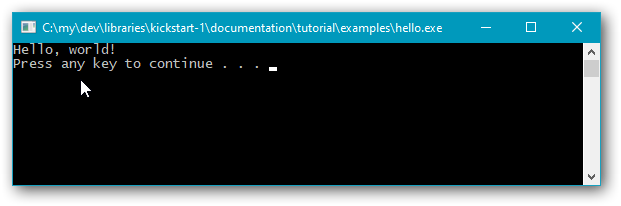
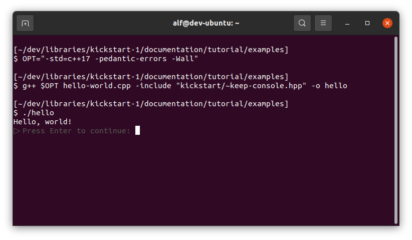

# **Kickstart library tutorial**

Kickstart is intended to ease the way for beginners in C++, and helps to shorten example code for those who help others on the net.

## **1. Installation & compiler requirements.**

All you need to do is download, copy and rename, so that the compiler finds the `<kickstart/`&hellip;`>` headers. There is no need to compile the library on its own. All the library code is in headers that you just `#include`.

Installation is described in more detail in [a separate document](../../source/examples/hello-world.md).

Then after installation, to use Kickstart you need to use a compiler option that specifies at least ***C++17***. Also, the Kickstart i/o functionality requires that C++ strings are UTF-8 encoded, which they’re not by default with the 2019 version of Microsoft’s Visual C++ compiler, and the Kickstart code uses the alternate keywords `and`, `or` and `not`, which again are a problem with Visual C++. Recommended options to guide the compilers:

| *Compiler:* | *Recommended core options:* |
|:-|:-|
| g++ &amp; clang | `-std=c++17` `-pedantic-errors` `-Wall` |
| Visual C++ | `/nologo` `/utf-8` `/EHsc` `/GR` `/permissive-` `/FI"iso646.h"` `/std:c++17` `/Zc:__cplusplus` `/W4` `/wd4459` `/D` `_CRT_SECURE_NO_WARNINGS` `/D` `_STL_SECURE_NO_WARNINGS` |

Happily, for Visual C++ options can be specified in environment variable `CL`, which is used automatically.

## **2. “Hello, world!” — or, keep that console window open, please.**

Here’s the classic “Hello, world!” program expressed with Kickstart console output:

*File ([hello-world.cpp](examples/hello-world.cpp)):*
~~~cpp
#include <kickstart/all.hpp>
using namespace kickstart::all;

auto main() -> int
{
    out << "Hello, world!" << endl;
}
~~~

`out`, `<<` and `endl` are names provided by the Kickstart library in namespace `kickstart::all`. When the output goes to a Windows console then it’s sent there via the UTF-16 based Windows API function `WriteConsoleW` so that e.g. non-English letters are treated correctly. In all other cases the `out` output is delegated to C’s `fwrite`.

However, conversion to text of non-textual arguments is handled by passing them to a `std::ostringstream`. That means that C++ iostreams can be be involved and contribute to an unreasonably large executable size, just as with use of `std::cout` output. A future goal is to remove that and *all* dependencies on iostreams so that the size of a C++ “Hello, world!” executable built by a beginner, can be much less unreasonable.

Result in an ordinary Windows console window:

> C:\my\dev\libraries\kickstart-1\documentation\tutorial\examples]  
> \> ***cl hello-world.cpp /Fe"hello"***  
> hello-world.cpp
> 
> [C:\my\dev\libraries\kickstart-1\documentation\tutorial\examples]  
> \> ***hello***  
> Hello, world!

Works! 😃

The **`cl`** command invokes the Visual C++ 2019 compiler, and option `/Fe"hello"` tells it to produce an executable named `hello.exe`, which can then be invoked with command `hello`.

---

Beginners that are learning in Windows, typically insert a “stop here” statement at the end of each program. This keeps the Windows console window open when the program has finished so that the program’s output can be viewed. The stopping statement can be a portable input statement, or it can be e.g. a Windows-specific `system("pause")`, but anyway it’s problematic in several ways:

* It’s *unreliable*: in a typical beginner's program the input buffer may not be empty at the end, so that the execution doesn’t stop at an input statement at the end.
* It’s *unclean*: the `main` code becomes less clean, and with a `system` command also needlessly non-portable.
* It’s *premature*: at the point where the program stops (if it stops), static cleanup has not yet been performed, so any effects from that can’t be observed.
* It’s *annoying*: when the program is run from a command interpreter the user needlessly has to interact with it to terminate it at the end.
* It’s *obstructive*: when the program is used in a script/batch file, including for testing such as measuring the run time, one must work around the stopping behavior.

With Kickstart you can largely avoid the above five problems by instead **force-including** the **`<kickstart/~keep-console.hpp>`** header. “Force-including” means that you use a compiler option to include it, instead of an `#include` directive in the code. With Visual C++ it’s option `/FI`, and with g++ it’s `-include`.

> [C:\my\dev\libraries\kickstart-1\documentation\tutorial\examples]  
> \> ***cl hello-world.cpp /FI"kickstart/~keep-console.hpp" /Fe"hello"***  
> hello-world.cpp
> 
> [C:\my\dev\libraries\kickstart-1\documentation\tutorial\examples]  
> \> ***hello***  
> Hello, world!

Uhm, hey, it’s just the same as before?!?

Yes, that’s by design. The behavior when the program is run from a command interpreter is exactly the same as before; no change. That supports the last two bullet points above, to not be annoying or obstructive.

But watch what happens when it’s run by double-clicking the executable in Windows Explorer:

Yay!

Notes:

1. There’s no guarantee that all relevant static cleanup has been performed at this point, because the stopping is done by the destructor of a global object. For example, an earlier opened file that has not been explicitly closed, may still be open so that it can’t yet be deleted. But all static cleanup performed by object destructors will in practice have been performed.

2. When you just want to keep the console window when you run your program from an IDE such as Visual Studio, then it’s much simpler to use the IDE’s functionality. For example, in Visual Studio run the program via keypress **Ctrl** + **F5**, and for example, in Code::Blocks run the program via keypress **F9**. However, the `<kickstart/~keep-console.hpp>` header can still be useful *for debugging* in an IDE, because typically the debugger does not provide a “keep console open” stop at the end.

---

The Unix version of `<kickstart/~keep-console.hpp>` always stops at the end, even when the program is run from a command interpreter:

> [~/dev/libraries/kickstart-1/documentation/tutorial/examples]  
> $ ***OPT="-std=c++17 -pedantic-errors -Wall"***  
> 
> [~/dev/libraries/kickstart-1/documentation/tutorial/examples]  
> $ ***g++ $OPT hello-world.cpp -include "kickstart/~keep-console.hpp" -o hello***  
> 
> [~/dev/libraries/kickstart-1/documentation/tutorial/examples]  
> $ ***./hello***  
> Hello, world!  
> ▷ Press Enter to continue: 

This rather primitive but at least reliable behavior is because any practical way to have double-clicking run a program in a terminal window, in Ubuntu, probably involves running the program via a shell such as Bash, so that in general there will be at least one and maybe more other processes attached to the console.

E.g., when the author explored double-clicking of modern g++-produced executables in the Nautilus file explorer in Gnome in Ubuntu, it turned out that “run a modern executable” functionality was not present by default (!), and *creating that functionality* involved some installations (which may or may not have been necessary) plus adding a file “[/usr/local/share/applications/run-in-terminal.desktop](examples/run-in-terminal/ubuntu/run-in-terminal.desktop)” that specified an “Open with” item that invoked a file “[/usr/local/bin/run-in-terminal.sh](examples/run-in-terminal/ubuntu/run-in-terminal.sh)” that, due to apparent bugs in `gnome-terminal`, dynamically created a “/tmp/” shell script to run the program, which script it in turn passed as “`--`”-command to `gnome-terminal`&hellip;

But the Ubuntu/Unix environment enabled a nice little feature, namely that the “Press Enter to continue:” text is presented in subdued gray color:

## **3. Text i/o.**

### **3.1. Output of text with non-English letters like Norwegian ÆØÅ.**

Pretend that you’re a Norwegian student named Bjørn Håvard Sæther. You want to write a portable C++ program that displays your name, whether you compile and run it in Linux or in Windows. That’s easy with Kickstart:

*File ([bhs.cpp](examples/bhs.cpp)):*
~~~cpp
#include <kickstart/all.hpp>
using namespace kickstart::all;

auto main() -> int
{
    out << "Dear world, Bjørn Håvard Sæther says hello!" << endl;
}
~~~

Output:

> Dear world, Bjørn Håvard Sæther says hello!

---

Here’s code that ideally should do the same, but using the C++ standard library directly:

*File ([bhs.stdlib.cpp](examples/bhs.stdlib.cpp)):*
~~~cpp
#include <iostream>
using namespace std;

auto main() -> int
{
    cout << "Dear world, Bjørn Håvard Sæther says hello!" << endl;
}
~~~

Output in a Windows console, using the defaults on the author’s system:

> Dear world, Bj├©rn H├Ñvard S├ªther says hello!

The gobbledygook appears because the console expects a different text encoding than UTF-8, and because *the Visual C++ standard library implementation does not address that issue*.

This is so also with the other common Windows compilers. The Windows C++ standard library implementations could have done the same as Kickstart, with Just Works&trade; behavior, but they don’t. Presumably that common misbehavior is due to common reuse of a core of flawed functionality in Microsoft’s C runtime library.

---

When you work in a Windows command interpreter, as opposed to running your program from an IDE or by double-clicking the executable, then you can use the `chcp` command to tell the console to expect UTF-8 encoding:

> [C:\my\dev\libraries\kickstart-1\documentation\tutorial\examples]  
> \> ***cl bhs.stdlib.cpp /Fe"bhs-stdlib"***  
> bhs.stdlib.cpp  
>  
> [C:\my\dev\libraries\kickstart-1\documentation\tutorial\examples]  
> \> ***chcp & bhs-stdlib***  
> Active code page: 850  
> Dear world, Bj├©rn H├Ñvard S├ªther says hello!
> 
> [C:\my\dev\libraries\kickstart-1\documentation\tutorial\examples]  
> \> ***chcp 65001 & bhs-stdlib***  
> Active code page: 65001  
> Dear world, Bjørn Håvard Sæther says hello!

`chcp` is short for *change codepage*. A **codepage** is a number that identifies a text encoding &mdash; it’s a scheme originally used by IBM, and adopted and adapted by Microsoft, SAS and others. Windows codepage 850 identifies a Scandinavian variant of the original IBM PC text encoding, and Windows codepage 65001 identifies UTF-8.

As of 2021, in Windows 10 codepage 65001 works for standard library UTF-8 *output*, and with [Microsoft Terminal](https://github.com/microsoft/terminal) it even works for emojis 😃, but it doesn’t work for standard library *input* 😒.

### **3.2. Input of text with non-English letters like Norwegian ÆØÅ.**

Kickstart only offers input of complete lines of text, at the highest level via a function **`input()`** → `string`.

With the function it’s easier to avoid non-`const` variables, and with the restriction to whole lines it’s easier to avoid the common beginner’s problem that an input buffer contains unconsumed text from some earlier input operation.

Example:

*File ([personalized-kickstart-greeting.cpp](examples/personalized-kickstart-greeting.cpp)):*
~~~cpp
#include <kickstart/all.hpp>
using namespace kickstart::all;

auto main() -> int
{
    const string name = input( "Hi, what’s your name? " );
    out << "Welcome to the Kickstart experience, " << name << "!" << endl;
}
~~~

Typical result:

> Hi, what’s your name? ***Bjørn Håvard Sæther***  
> Welcome to the Kickstart experience, Bjørn Håvard Sæther!

The above result was obtained in a classic Windows console, showing that Kickstart input deals correctly with non-English characters in this environment.

The code also shows that the `kickstart::all` namespace brings in some select often used identifiers from the standard library; here `string` is `std::string`. The `endl` identifier is however not the one from the standard library. That can possibly be worth being aware of.

---

Here’s code that ideally should do the same, but using the C++ standard library directly:

*File ([personalized-kickstart-greeting.stdlib.cpp](examples/personalized-kickstart-greeting.stdlib.cpp)):*
~~~cpp
#include <iostream>
#include <string>
using namespace std;

auto fail() -> bool { throw "Gah!"; }

auto main() -> int
{
    string name;
    cout << "Hi, what’s your name? ";
    getline( cin, name ) or fail();
    cout << "Welcome to the C++ standard library experience, " << name << "!" << endl;
}
~~~

Typical result in a default Windows classic console on the author’s system, with a `chcp` command reporting the active codepage:

> Active code page: 850  
> Hi, whatÔÇÖs your name? ***Bjørn Håvard Sæther***  
> Welcome to the C++ standard library experience, Bjørn Håvard Sæther!

Uhuh. Some trouble with the UTF-8 encoded round apostrophe, so let’s switch to codepage 65001:

> Active code page: 65001  
> Hi, what’s your name? ***Bjørn Håvard Sæther***  
> Welcome to the C++ standard library experience, Bj rn H vard S ther!

Now the round apostrophe is correctly presented. Codepage 65001 works for standard library UTF-8 *output*. But the non-ASCII characters in the name “Bjørn Håvard Sæther” are not handled correctly: they end up being presented as spaces! Actually the Windows API level’s `ReadFile` function produces a string with zero values for these input characters, and the current Windows implementations of the C++ standard library all blithely assume that `ReadFile` works, so codepage 65001 decidedly does not work for standard library *input*.

And as of early 2021 this happens with C++ standard library input whether one uses a classic console or Microsoft Terminal.

---

By default `std::cin` input operations just fail silently, which can wreak all kinds of serious havoc: a crash, a hang, or a plausible but incorrect result that is believed, and incurs devastating costs for a company&hellip;

In contrast, when Kickstart’s `input()` detects End Of File&trade; — about the only way that input of a line can fail — it throws an exception.

To ensure that such exceptions are reported to you if they escape out of your main code, you can replace your `main` function with a function named e.g. `cppmain`, and provide a one-liner little micro-`main` that calls that function via Kickstart’s **`with_exceptions_displayed`**:

*File ([personalized-kickstart-greeting.with-exceptions-reported.cpp](examples/personalized-kickstart-greeting.with-exceptions-reported.cpp)):*
~~~cpp
#include <kickstart/all.hpp>
using namespace kickstart::all;

void cppmain()
{
    const string name = input( "Hi, what’s your name? " );
    out << "Welcome to the Kickstart experience, " << name << "!" << endl;
}

auto main() -> int { return with_exceptions_displayed( cppmain ); }
~~~

For example, in a Windows console window, when you respond to this program’s prompt

> Hi, what’s your name?

&hellip; by pressing **Ctrl** **Z** and then Enter, you get

> Hi, what’s your name? ***^Z***  
> !input_from - At end of file.

Here `input_from` is the function that `input` calls and that detected EOF.

`with_exceptions_displayed` does not propagate the exception (if any), but just returns standard `EXIT_FAILURE` if there was an exception, and otherwise it returns standard `EXIT_SUCCESS`.

### 3.3 **Input of numbers.**

Unlike the standard library Kickstart has no dedicated number input operation. Instead you just input a line of text with `input()`, as usual. You can then attempt to convert that line to a number, e.g. with **`to_<int>`** or `to_<double>`:

*File ([personalized-kickstart-greeting.with-age.cpp](examples/personalized-kickstart-greeting.with-age.cpp)):*
~~~cpp
#include <kickstart/all.hpp>
using namespace kickstart::all;

void cppmain()
{
    const string name = input( "Hi, what’s your name? " );
    const int age = to_<int>( input( "And please, your age (in years)? " ) );

    out << "Welcome to the Kickstart experience, "
        << age << " year" << (age == 1? "": "s")
        << " old "<< name << "!" << endl;
}

auto main() -> int { return with_exceptions_displayed( cppmain ); }
~~~

Typical result:

> Hi, what’s your name? ***Alf***  
> And please, your age (in years)? ***58***  
> Welcome to the Kickstart experience, 58 years old Alf!

Note: as of early 2021 `to_` only supports types `int` and `double`.

---

If the string argument is an invalid value specification for the result type, then `to_` throws an exception with exception text depending on the kind of spec error:

> Hi, what’s your name? ***Alf***  
> And please, your age (in years)? ***58.3***  
!to_ - Decimals were specified for an integer value.

The exception text is always in English because it’s a message intended for programmers.

Different types of exception are thrown for different conditions, so you can differentiate between different failures. E.g. for the purpose of providing explanatory messages to the user. See the Kickstart source code for details.

---

Unlike e.g. `std::stoi`, Kickstart’s `to_<int>` will accept a specification like `1e6`, meaning one million:

> Hi, what’s your name? ***Alf***  
> And please, your age (in years)? ***1e6***  
Welcome to the Kickstart experience, 1000000 years old Alf!

It will also accept an integer value specified with decimals if they’re all zero, e.g.

> Hi, what’s your name? ***Alf***  
> And please, your age (in years)? ***58.000***  
> Welcome to the Kickstart experience, 58 years old Alf!

However, this is accomplished internally by trying to interpret the string as a `double` value specification and checking whether that yields an exact integer. Therefore `to_<int>` may accept a smaller range of values than supported by `int`. In practice this can happen with a compiler and platform where both `int` and `double` are 64-bit, when the specified value is ≥ 2⁵³ (a rather large number!), but in Windows `int` is 32-bit so that range limit is hit first.

### **3.4 Tabular output of numbers.**

The Kickstart `out` stream is  a *very* shallow wrapper over a function called `output`. It just passes the `<<` arguments to that function. There is nothing like the standard library iostreams formatting, nothing like e.g. `std::setw`.

Instead, where you want to e.g. place some output right-adjusted in a field *n* characters wide, you just use the **`at_right_in`** function. There’s also a corresponding `at_left_in`, of course. These functions take the field width *n* as an `int` 1ˢᵗ parameter, and the something to be displayed as a `std::string_view` 2ⁿᵈ parameter.

 You can pass a `std::string` directly as argument to second parameter. And one way to get a string from e.g. an `int` value, is to use the Kickstart `str` function (or you could use e.g. `std::to_string`). It can go like this:

*File ([multiplication-table.cpp](examples/multiplication-table.cpp)):*
~~~cpp
#include <kickstart/all.hpp>
using namespace kickstart::all;

auto main() -> int
{
    const int n = 12;
    for( int row = 1; row <= n; ++row ) {
        for( int col = 1; col <= n; ++col ) {
            out << at_right_in( 4, str( row*col ) );
        }
        out << endl;
    }
}
~~~

Result:

~~~txt
   1   2   3   4   5   6   7   8   9  10  11  12
   2   4   6   8  10  12  14  16  18  20  22  24
   3   6   9  12  15  18  21  24  27  30  33  36
   4   8  12  16  20  24  28  32  36  40  44  48
   5  10  15  20  25  30  35  40  45  50  55  60
   6  12  18  24  30  36  42  48  54  60  66  72
   7  14  21  28  35  42  49  56  63  70  77  84
   8  16  24  32  40  48  56  64  72  80  88  96
   9  18  27  36  45  54  63  72  81  90  99 108
  10  20  30  40  50  60  70  80  90 100 110 120
  11  22  33  44  55  66  77  88  99 110 121 132
  12  24  36  48  60  72  84  96 108 120 132 144
  ~~~

Using a fixed width font preformatted block for the above result display in order to get the console window text formatting correct.

### **3.5 Formatting of floating point values.**

The `out <<` operation converts a floating point value to text via `str`. This default conversion is handy but gives you no control over the number of presented decimals. To control that you can use the **`to_fixed`** and **`to_scientific`** functions:

*File ([floating-point-formatting.cpp](examples/floating-point-formatting.cpp)):*
~~~cpp
#include <kickstart/all.hpp>
using namespace kickstart::all;

auto main() -> int
{
    double x = math::pi;
    for( int i = 1; i <= 5; ++i, x *= 1000 ) {
        out << at_right_in( 20, str( x ) )
            << at_right_in( 20, to_fixed( x, 4 ) )
            << at_right_in( 20, to_scientific( x, 4 ) )
            << endl;
    }
}
~~~

Result:

~~~txt
             3.14159              3.1416          3.1416e+00
             3141.59           3141.5927          3.1416e+03
         3.14159e+06        3141592.6536          3.1416e+06
         3.14159e+09     3141592653.5898          3.1416e+09
         3.14159e+12  3141592653589.7930          3.1416e+12
~~~

Here [`math::pi`](https://github.com/alf-p-steinbach/kickstart/blob/4c82e9565471102008732a80ec93ba85f5ec5aee/source/library/core/language/stdlib-extensions/math.hpp#L42) is a constant defined by Kickstart. C++20 defines [`std::numbers::pi`](https://en.cppreference.com/w/cpp/numeric/constants), but for C++17 and earlier one had to make do with the Posix standard’s macro [`M_PI`](https://pubs.opengroup.org/onlinepubs/9699919799/basedefs/math.h.html). Usually one would just define the π constant in DIY fashion.

Note: `double` represents a limited number of digits of a value. When you try to present more digits you’ll generally get arbitrary nonsense. Thus, the last fixed point value `3141592653589.7930` is not entirely correct in the last digit; the mathematically correct rounded value would be `3141592653589.7932` (the digit sequence continues `3846`…).

## **4. Command line arguments.**

### **4.1 The `process::the_commandline()` function.**
The main Kickstart way to access command line arguments is via the **`process::the_commandline()`** function, which returns a reference to a static object:

*File ([command-line-args.cpp](examples/command-line-args.cpp)):*
~~~cpp
#include <kickstart/all.hpp>
using namespace kickstart::all;

auto main() -> int
{
    const auto& cmd = process::the_commandline();

    out << cmd.verb() << endl;
    for( const string& arg: cmd.args() ) {
        out << arg << endl;
    }
}
~~~

`process` is a namespace for process related functionality. I.e. it’s not a verb, it doesn’t indicate that `process::the_commandline()` does things with the command line, such as parsing it. Although it actually does that in Windows; hm.

Anyway, result in a classic Windows console, with a `chcp` command reporting the active codepage at the start:

> [C:\my\dev\libraries\kickstart-1\documentation\tutorial\examples]  
> \> ***chcp & command-line-args.exe blåbærsyltetøy "(blueberry jam)" could be used in a π***  
> Active code page: 850  
> command-line-args.exe  
> blåbærsyltetøy  
> (blueberry jam)  
> could  
> be  
> used  
> in  
> a  
> π

Works! 😃

Except that

* *as of early 2021 “get commandline from OS” is only implemented for Windows and Linux.*

In particular there’s as yet no implementation for the Mac. So what to do on the Mac?

### **4.2 Using the `main` arguments as a default in non-Windows systems.**

In Unix environments, which includes the Mac, as of 2021 the `main` arguments can in practice be relied on to be UTF-8 encoded.

You can therefore pass these “raw” command line arguments to the Kickstart `with_exceptions_displayed` function, which by default will do one of two things:

* on a Windows system the passed arguments are ignored (because they likely contain distorted information) and the command line is retreived from the OS, while

* on other systems the passed command line arguments are used to initialize the command line singleton, presently just assuming that they’re valid UTF-8.

It can go like this:

*File ([command-line-args.portable.cpp](examples/command-line-args.portable.cpp)):*
~~~cpp
#include <kickstart/all.hpp>
using namespace kickstart::all;

void cppmain()
{
    const auto& cmd = process::the_commandline();

    out << cmd.verb() << endl;
    for( const string& arg: cmd.args() ) {
        out << arg << endl;
    }
}

auto main( int n_cmd_parts, char** cmd_parts )
    -> int
{ return with_exceptions_displayed( cppmain, n_cmd_parts, cmd_parts ); }
~~~

Result in a classic Windows console, where the passed arguments are ignored:

> [C:\my\dev\libraries\kickstart-1\documentation\tutorial\examples]  
> \> ***command-line-args.portable.exe Maybe, blåbærsyltetøy in a π?***  
> command-line-args.portable.exe  
> Maybe,  
> blåbærsyltetøy  
> in  
> a  
> π?

Result in WSL Ubuntu, where now the passed arguments are used:

> [/mnt/e/root/c/my/dev/libraries/kickstart-1/documentation/tutorial/examples]  
> \$ **./command-line-args.portable Maybe, blåbærsyltetøy in a π?**  
> ./command-line-args.portable
> Maybe,  
> blåbærsyltetøy  
> in  
> a  
> π?  

---

xxx

**`Array_span_`** is a basic array span class template. C++20 offers [`std::span`](https://en.cppreference.com/w/cpp/container/span) for this. Kickstart’s `Array_span_` corresponds to a pared down C++20 `std::span` with dynamic extent.

**`with_command_line_parts`** picks up the command line parts information from the operating system and calls the specified function, here `cppmain`. It doesn’t catch and display exceptions. If you want exceptions reported then just use the ordinary `with_exceptions_displayed`, which uses `with_command_line_parts` automatically.

xxx
