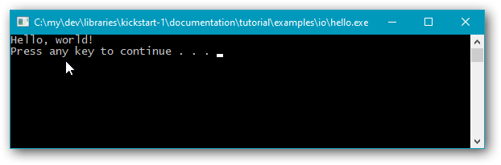
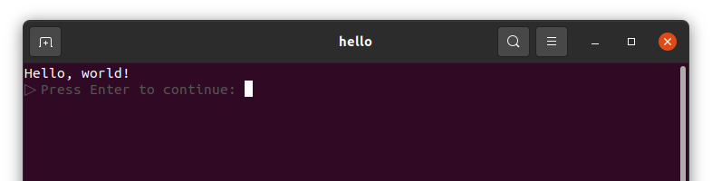

# **Kickstart library tutorial**

Kickstart is intended to ease the way for beginners in C++, and can shorten example code for those who help others on the net.

<!-- START doctoc generated TOC please keep comment here to allow auto update -->
<!-- DON'T EDIT THIS SECTION, INSTEAD RE-RUN doctoc TO UPDATE -->

- [**1. Installation & compiler requirements.**](#1-installation--compiler-requirements)
- [**2. “Hello, world!” — or, keep that console window open, please.**](#2-hello-world--or-keep-that-console-window-open-please)
  - [**2.1. Use basic Kickstart output.**](#21-use-basic-kickstart-output)
  - [**2.2. Prevent console window closing in Windows, in a good way.**](#22-prevent-console-window-closing-in-windows-in-a-good-way)
  - [**2.3. Prevent console window closing in Unix.**](#23-prevent-console-window-closing-in-unix)
- [**3. Text i/o.**](#3-text-io)
  - [**3.1. Output text with non-English letters like Norwegian ÆØÅ.**](#31-output-text-with-non-english-letters-like-norwegian-%C3%A6%C3%B8%C3%A5)
  - [**3.2. Input text with non-English letters like Norwegian ÆØÅ.**](#32-input-text-with-non-english-letters-like-norwegian-%C3%A6%C3%B8%C3%A5)
  - [**3.3. Display exception messages.**](#33-display-exception-messages)
  - [**3.4. Input a number.**](#34-input-a-number)
  - [**3.5. Input a sequence of numbers, any way you like.**](#35-input-a-sequence-of-numbers-any-way-you-like)
  - [**3.6. Display a table of numbers.**](#36-display-a-table-of-numbers)
  - [**3.7. Format floating point values nicely.**](#37-format-floating-point-values-nicely)
- [**4. Command line arguments.**](#4-command-line-arguments)
  - [**4.1. Access the command line arguments.**](#41-access-the-command-line-arguments)
  - [**4.2. Use the `main` arguments as a default in non-Windows systems.**](#42-use-the-main-arguments-as-a-default-in-non-windows-systems)
  - [**4.3. Parse command line options via a 3ʳᵈ party library.**](#43-parse-command-line-options-via-a-3%CA%B3%E1%B5%88-party-library)
- [**5. Text files.**](#5-text-files)
  - [**5.1. Display lines from a text file.**](#51-display-lines-from-a-text-file)
  - [**5.2. Access a file in the executable’s directory.**](#52-access-a-file-in-the-executables-directory)
  - [**5.3. Save text to a file.**](#53-save-text-to-a-file)

<!-- END doctoc generated TOC please keep comment here to allow auto update -->

## **1. Installation & compiler requirements.**

All you need to do is download and copy (or link), so that the compiler finds the `<kickstart/`&hellip;`>` headers. There is no need to compile the library on its own. All the library code is in headers that you just `#include`.

Installation is described in more detail in [a separate document](../installation/main.md).

Then after installation, to use Kickstart you need to use a compiler option that specifies at least ***C++17***. Also, the Kickstart i/o functionality requires that C++ strings are UTF-8 encoded, which they’re not by default with the 2019 version of Microsoft’s Visual C++ compiler, and the Kickstart code uses the alternate keywords `and`, `or` and `not`, which again are a problem with Visual C++. Recommended options to guide the compilers:

| *Compiler:* | *Recommended core options:* |
|:-|:-|
| g++ | `-std=c++17` `-pedantic-errors` `-Wall` |
| clang | `-std=c++17` `-pedantic-errors` `-Wall`  *In Windows add also* `-D` `_CRT_SECURE_NO_WARNINGS=1` `-D` `_STL_SECURE_NO_WARNINGS=1` *On the Mac add also* `-mmacosx-version-min=10.15` |
| Visual&nbsp;C++ | `/nologo` `/utf-8` `/EHsc` `/GR` `/permissive-` `/FI"iso646.h"` `/std:c++17` `/Zc:__cplusplus` `/W4` `/wd4459` `/D` `_CRT_SECURE_NO_WARNINGS=1` `/D` `_STL_SECURE_NO_WARNINGS=1` |

Happily, for Visual C++ options can be specified in environment variable `CL`, which is used automatically.

## **2. “Hello, world!” — or, keep that console window open, please.**

By creating a “Hello, world!” program you learn the necessary coding and tool usage to get a verifiable textual result, which enables you to experiment and in that way learn more about e.g. a new language, or in this case, a library.

*Problem:* when you use an IDE in Windows, then the visible “Hello, world!” result *can* be just that a console window pops up and immediately disappears…

Kickstart provides a practical way to avoid that, but let’s first look at just building and running “Hello, world!” in the command line, where there is no such problem.

### **2.1. Use basic Kickstart output.**

Here’s the classic “Hello, world!” program expressed with Kickstart console output:

*File ([io/hello-world.cpp](examples/io/hello-world.cpp)):*
~~~cpp
#include <kickstart/all.hpp>
using namespace kickstart::all;

auto main() -> int
{
    out << "Hello, world!" << endl;
}
~~~

`out`, `<<` and `endl` are names provided by the Kickstart library in namespace `kickstart::all`. When the output goes to a Windows console then it’s sent there via the UTF-16 based Windows API function `WriteConsoleW` so that e.g. non-English letters are treated correctly. In all other cases the `out` output is delegated to C’s `fwrite`.

Result in an ordinary Windows console window:

> C:\my\dev\libraries\kickstart-1\documentation\tutorial\examples\io\]  
> \> ***cl hello-world.cpp /Fe"hello"***  
> hello-world.cpp
> 
> [C:\my\dev\libraries\kickstart-1\documentation\tutorial\examples\io\]  
> \> ***hello***  
> Hello, world!

Works! 😃

The **`cl`** command invokes the Visual C++ 2019 compiler, and option `/Fe"hello"` tells it to produce an executable named `hello.exe`, which can then be invoked with command `hello`.

### **2.2. Prevent console window closing in Windows, in a good way.**

Beginners that are learning in Windows, typically insert a “stop here” statement at the end of each program. This keeps the Windows console window open when the program has finished so that the program’s output can be viewed. The stopping statement can be a portable input statement, or it can be e.g. a Windows-specific `system("pause")`, but anyway it’s problematic:

* It’s *unreliable*: in a typical beginner's program the input buffer may not be empty at the end, so that the execution doesn’t stop at an input statement at the end.
* It’s *unclean*: the `main` code becomes less clean, and with a `system` command also needlessly non-portable.
* It’s *premature*: at the point where the program stops (if it stops), static cleanup has not yet been performed, so any effects from that can’t be observed.
* It’s *annoying*: when the program is run from a command interpreter the user needlessly has to interact with it to terminate it at the end.
* It’s *obstructive*: when the program is used in a script/batch file, including for testing such as measuring the run time, one must work around the stopping behavior.

With Kickstart you can largely avoid the above five problems by instead **force-including** the **`<kickstart/~keep-console.hpp>`** header. “Force-including” means that you use a compiler option to include it, instead of an `#include` directive in the code. With Visual C++ it’s option `/FI`, and with g++ it’s `-include`.

> [C:\my\dev\libraries\kickstart-1\documentation\tutorial\examples\io\]  
> \> ***cl hello-world.cpp /FI"kickstart/~keep-console.hpp" /Fe"hello"***  
> hello-world.cpp
> 
> [C:\my\dev\libraries\kickstart-1\documentation\tutorial\examples\io\]  
> \> ***hello***  
> Hello, world!

Uhm, hey, it’s just the same as before?!?

Yes, that’s by design. The behavior when the program is run from a command interpreter is exactly the same as before; no change. That supports the last two bullet points above, to not be annoying or obstructive.

But watch what happens when it’s run by double-clicking the executable in Windows Explorer:

Notes:

1. All static cleanup performed by object destructors will in practice have been performed, but there’s no guarantee that all relevant static cleanup has been performed at this point.

2. When you just want to keep the console window when you run your program (without debugging) from an IDE such as Visual Studio, then it can be much simpler to use the IDE’s functionality. For example, in Visual Studio run the program via keypress **Ctrl** + **F5**. And, for example, in Code::Blocks run the program via keypress **F9**.

### **2.3. Prevent console window closing in Unix.**

The Unix version of `<kickstart/~keep-console.hpp>` always stops at the end, even when the program is run from a command interpreter:

> [~/dev/libraries/kickstart-1/documentation/tutorial/examples/io]  
> $ ***OPT="-std=c++17 -pedantic-errors -Wall"***  
> 
> [~/dev/libraries/kickstart-1/documentation/tutorial/examples/io]  
> $ ***g++ $OPT hello-world.cpp -include "kickstart/~keep-console.hpp" -o hello***  
> 
> [~/dev/libraries/kickstart-1/documentation/tutorial/examples/io]  
> $ ***./hello***  
> Hello, world!  
> ▷ Press Enter to continue: 

This rather primitive but at least reliable behavior is because any practical way to have double-clicking run a program in a terminal window, in Ubuntu, [probably involves running the program via a shell such as Bash](details/running_your_executable_by_double-clicking_in_Ubuntu.md), so that in general there will be at least one and maybe more other processes attached to the console.

But the Ubuntu/Unix environment enabled a nice little feature, namely that the “Press Enter to continue:” text is presented in subdued gray color:
> [~/dev/libraries/kickstart-1/documentation/tutorial/examples/io]  
> $ ***gnome-terminal -t hello -- ./hello&***  

## **3. Text i/o.**

*Problem*: as of C++20 the C++ standard library is still stuck in an archaic technology where the default text encoding that i/o operations assume for a `char` string, depends on the environment.

In Windows that environment’s default depends on whether the program is built with console subsystem or GUI subsystem. Current C++ standard library implementations generally use the GUI subsystem encoding default even for (the default!) console subsystem, i.e., for the usual students’s programs the default encoding that one gets is at odds with the actual environment. And, less easy to rectify, that default is also at odds with modern programming, because it’s usually not UTF-8 but instead some country specific variant of the single-byte-per-character encoding called Windows ANSI Western…

Kickstart text i/o supports using UTF-8 throughout, also in Windows consoles.

### **3.1. Output text with non-English letters like Norwegian ÆØÅ.**

Pretend that you’re a Norwegian student named Bjørn Håvard Sæther. You want to write a portable C++ program that displays your name, whether you compile and run it in Linux or in Windows. That’s easy with Kickstart:

*File ([io/bhs.cpp](examples/io/bhs.cpp)):*
~~~cpp
#include <kickstart/all.hpp>
using namespace kickstart::all;

auto main() -> int
{
    out << "Dear world, Bjørn Håvard Sæther says hello!" << endl;
}
~~~

Output:

> Dear world, Bjørn Håvard Sæther says hello!

To people unfamiliar with Windows programming, functionality that just *outputs the specified text* may not seem so impressive, but code that directly uses `printf` or the `std::cout` stream in Windows will instead by default produce gobbledygook like [“Dear world, Bj├©rn H├Ñvard S├ªther says hello!”](details/output_of_international_text_in_Windows.md).

Note: To display emojis like 😃 correctly in Windows you will generally have to use a terminal emulator like [**Microsoft Terminal**](https://github.com/microsoft/terminal). Kickstart defines [names for the original IBM PC symbols](../../source/library/kickstart/console/portable_dingbats.hpp#L36), if you want to use them. But the IBM PC symbols like <big>`☺`</big>, are not as nice as real color emoticons in e.g. Terminal.

### **3.2. Input text with non-English letters like Norwegian ÆØÅ.**

Kickstart only offers input of complete lines of text, at the highest level via a function **`input()`** → `string`.

With the function it’s easier to avoid non-`const` variables, and with the restriction to whole lines it’s easier to avoid the common beginner’s problem that an input buffer contains unconsumed text from some earlier input operation.

Example:

*File ([io/personalized-kickstart-greeting.cpp](examples/io/personalized-kickstart-greeting.cpp)):*
~~~cpp
#include <kickstart/all.hpp>
using namespace kickstart::all;

auto main() -> int
{
    const string name = input( "Hi, what’s your name? " );
    out << "Welcome to the Kickstart experience, " << name << "!" << endl;
}
~~~

Typical result:

> Hi, what’s your name? ***Bjørn Håvard Sæther***  
> Welcome to the Kickstart experience, Bjørn Håvard Sæther!

---

The above result was obtained in a classic Windows console, showing that Kickstart input deals correctly with non-English characters in this environment, which is helpful because as of early 2021 [current Windows implementations of the C++ standard library fail to input non-ASCII characters](details/input_of_international_text_in_Windows.md) as UTF-8.

---

The code also shows that the `kickstart::all` namespace brings in some select often used identifiers from the standard library, here `string`. [The complete list](../../source/library/kickstart/core/language/stdlib-includes/basics.hpp#L36) is very short: *`array`*, *`begin`*, *`end`*, *`size`*, *`ssize`*, *`string`*, *`string_view`*, *`vector`*, *`function`*, *`optional`*, *`exchange`*, *`forward`*, *`move`*, and *`pair`*. The `endl` identifier used above is however not the one from the standard library.

### **3.3. Display exception messages.**

When Kickstart’s `input()` detects End Of File&trade; — about the only way that input of a text line can fail — it throws an exception.

To ensure that such exceptions are reported to you if they escape out of your main code, you can

* replace your `main` function with a function named e.g. `cppmain`, and
* provide a one-liner little micro-`main` that calls that function via Kickstart’s **`with_exceptions_displayed`**.

*File ([io/personalized-kickstart-greeting.v2.with-exceptions-reported.cpp](examples/io/personalized-kickstart-greeting.v2.with-exceptions-reported.cpp)):*
~~~cpp
#include <kickstart/all.hpp>
using namespace kickstart::all;

void cppmain()
{
    const string name = input( "Hi, what’s your name? " );
    out << "Welcome to the Kickstart experience, " << name << "!" << endl;
}

auto main() -> int { return with_exceptions_displayed( cppmain ); }
~~~

For example, in a Windows console window, when you respond to this program’s prompt

> Hi, what’s your name?

&hellip; by pressing **Ctrl** + **Z** and then Enter, you get

> Hi, what’s your name? ***^Z***  
> !input - At end of file.

Here `input` is the function that detected EOF, but (digression to prevent misunderstanding) as it happens that’s *not* the top level freestanding `input` function directly used above. Function names in Kickstart exceptions are not qualified; they’re just the names picked up via the standard [`__func__`](https://en.cppreference.com/w/c/language/function_definition#func) pseudo-macro. However, later versions of Kickstart may provide more rich exception origin information, in particular a qualified function name.

`with_exceptions_displayed` uses a [`catch(const std::exception&)`](https://en.cppreference.com/w/cpp/language/try_catch#Example) to catch the exception (if any), but it does not propagate the exception. It just presents the exception message and returns standard [`EXIT_FAILURE`](https://en.cppreference.com/w/cpp/utility/program/EXIT_status). Otherwise, with no exception, it returns standard [`EXIT_SUCCESS`](https://en.cppreference.com/w/cpp/utility/program/EXIT_status).

### **3.4. Input a number.**

Unlike the standard library Kickstart has no dedicated number input operation. Instead you just input a line of text with `input()`, as usual. You can then attempt to convert that line to a number, e.g. with **`to_<int>`** or `to_<double>`:

*File ([io/personalized-kickstart-greeting.v3.with-age.cpp](examples/io/personalized-kickstart-greeting.v3.with-age.cpp)):*
~~~cpp
#include <kickstart/all.hpp>
using namespace kickstart::all;

void cppmain()
{
    const string name = input( "Hi, what’s your name? " );
    const int age = to_<int>( input( "And please, your age (in years)? " ) );

    out << "Welcome to the Kickstart experience, "
        << age << " year" << (age == 1? "": "s")
        << " old "<< name << "!" << endl;
}

auto main() -> int { return with_exceptions_displayed( cppmain ); }
~~~

Typical result:

> Hi, what’s your name? ***Alf***  
> And please, your age (in years)? ***58***  
> Welcome to the Kickstart experience, 58 years old Alf!

Note: as of early 2021 `to_` only supports types `int` and `double`.

---

Unlike e.g. `std::stoi`, Kickstart’s `to_<int>` will accept a specification like `1e6`, meaning one million:

> Hi, what’s your name? ***Alf***  
> And please, your age (in years)? ***1e6***  
Welcome to the Kickstart experience, 1000000 years old Alf!

However, this is accomplished internally by trying to interpret the string as a `double` value specification and checking whether that yields an exact integer. Therefore `to_<int>` may accept a smaller range of values than supported by `int`. In practice this can happen with a compiler and platform where both `int` and `double` are 64-bit, when the specified value is ≥ 2⁵³ (a rather large number!), but in Windows `int` is 32-bit so that range limit is hit first.

---

If the string argument is an invalid value specification for the result type, then `to_` throws an exception with exception text depending on the kind of spec error:

> Hi, what’s your name? ***Alf***  
> And please, your age (in years)? ***58.3***  
!to_ - Decimals were specified for an integer value.

The exception text is always in English because it’s a message intended for programmers.

Different types of exception are thrown for different conditions, so you can differentiate between different failures. E.g. for the purpose of providing explanatory messages to the user. See the Kickstart source code for details.

### **3.5. Input a sequence of numbers, any way you like.**

One way to input a sequence of numbers is to input one per line:

*File ([io/sum.v1.cpp](examples/io/sum.v1.cpp)):*
~~~cpp
#include <kickstart/all.hpp>
using namespace kickstart::all;

void cppmain()
{
    out << "This will calculate the sum of numbers like 2.17 and 3.14." << endl;
    out << "Enter one number per line. Just press return to calculate the sum." << endl;

    vector<double> numbers;
    out << endl;
    for( ;; ) {
        const string spec = input( "A number (or just return), please? " );
        if( spec == "" ) {
            break;
        }
        numbers.push_back( to_<double>( spec ) );
    }
    
    out << endl;
    for( const double& x: numbers ) {
        out << (&x > &numbers.front()? " + " : "") << x;
    }
    out << " = " << math::sum_of( numbers ) << "." << endl;
}

auto main() -> int { return with_exceptions_displayed( cppmain ); }
~~~

Example run:

> This will calculate the sum of numbers like 2.17 and 3.14.  
> Enter one number per line. Just press return to calculate the sum.  
> 
> A number (or just return), please? ***1.2***  
> A number (or just return), please? ***3.45***  
> A number (or just return), please? ***6.789***  
> A number (or just return), please?  
> 
> 1.2 + 3.45 + 6.789 = 11.439.

Details. In this code **`math::sum_of`** is a Kickstart function corresponding roughly to [`std::accumulate`](https://en.cppreference.com/w/cpp/algorithm/accumulate), just way more convenient. And the perhaps mysterious-looking expression `&x > &numbers.front()` checks whether `x` is beyond the first item in the `vector`, in which case the code presents a “+” before it.

---

An alternative is to let the user type in a single line of numbers separated by spaces:

*File ([io/sum.v2.cpp](examples/io/sum.v2.cpp)):*
~~~cpp
#include <kickstart/all.hpp>
using namespace kickstart::all;

void cppmain()
{
    out << "This will calculate the sum of numbers like 2.17 and 3.14." << endl;
    out << "Enter the numbers on one line, separated by spaces." << endl;

    out << endl;
    const string    spec    = input( "Numbers, please? " );
    const auto      numbers = parts_to_vector_<double>( spec );

    out << endl;
    for( const double& x: numbers ) {
        out << (&x > &numbers.front()? " + " : "") << x;
    }
    out << " = " << math::sum_of( numbers ) << "." << endl;
}

auto main() -> int { return with_exceptions_displayed( cppmain ); }
~~~

Example run:

> This will calculate the sum of numbers like 2.17 and 3.14.  
> Enter the numbers on one line, separated by spaces.  
> 
> Numbers, please? ***1.2&nbsp;&nbsp;3.45&nbsp;&nbsp;6.789***
> 
> 1.2 + 3.45 + 6.789 = 11.439.

The [**`parts_to_vector_`**](../../source/library/kickstart/core/text-conversion/to-number/to_.hpp#77) function in the expression

~~~
parts_to_vector_<double>( spec );
~~~

… splits the `spec` string into whitespace-separated parts, where each part is then parsed as a `double` number specification, with that number appended to the result `vector`.

Indeed `parts_to_vector_` is a simple convenience wrapper over the more basic functions [**`to_vector_`**](../../source/library/kickstart/core/text-conversion/to-number/to_.hpp#66) and [**`split_on_whitespace`**](../../source/library/kickstart/core/stdlib-extensions/strings.hpp#125), which you can use instead.

---

The above two ways can be combined for a better user experience, supporting any number of input lines with any number of values per line. However, for that functionality the code can be much simpler and much reduced by using the [`Text_parts_reader`]() class, which reads whitespace-separated text parts much like the standard library’s iostreams `>>` does. The `input_part()` function returns an `optional<string_view>` valid until the next read operation; the `input_part_view()` function returns a `string_view` (with same validity guarantee) or throws; and the `input_part_string` returns a `string`, or throws.

By default a `Text_parts_reader` reads from `stdin` and stops — returns empty optional or throws — on the first empty input line:

*File ([io/sum.v3.cpp](examples/io/sum.v3.cpp)):*
~~~cpp
#include <kickstart/all.hpp>
using namespace kickstart::all;

void cppmain()
{
    out << "This will calculate the sum of numbers like 2.17 and 3.14." << endl;
    out << "Enter one or more numbers per line. Just"
           " press return to calculate the sum." << endl;
    out << endl;

    auto numbers    = vector<double>();
    auto reader     = Text_parts_reader( "Numbers (or just return), please? " );
    while( const optional<string_view> spec = reader.input_part() ) {
        numbers.push_back( to_<double>( spec.value() ) );
    }

    out << endl;
    for( const double& x: numbers ) {
        out << (&x > &numbers.front()? " + " : "") << x;
    }
    out << " = " << math::sum_of( numbers ) << "." << endl;
}

auto main() -> int { return with_exceptions_displayed( cppmain ); }
~~~

Example run:

> This will calculate the sum of numbers like 2.17 and 3.14.  
> Enter one or more numbers per line. Just press return to calculate the sum.  
> 
> Numbers (or just return), please? ***1.2***  
> Numbers (or just return), please? ***3.45 6.789***  
> Numbers (or just return), please?  
> 
> 1.2 + 3.45 + 6.789 = 11.439.

There is also a `C_file_text_parts_reader` that’s useful for reading whitespace-separated text parts from a C `FILE*`. The ordinary `Text_parts_reader` can issue a prompt for every line input operation, as it does in the code above, and it uses functionality to read UTF-8 encoded text from a Windows console. `C_file_text_parts_reader` is more lean ’n mean: it neither prompts nor ensures UTF-8 encoding for standard stream input.

### **3.6. Display a table of numbers.**

The Kickstart `out` stream is  a *very* shallow wrapper over a function called `output`. It just passes the `<<` arguments to that function. There is nothing like the standard library iostreams formatting, nothing like e.g. `std::setw`.

Instead, where you want to e.g. place some ASCII output right-adjusted in a field *n* characters wide, you just use the [**`ascii::at_right_in`**](../../source/library/kickstart/core/text-encoding/ascii/string-util.hpp#L84) function. The “ASCII” is not really a restriction to ASCII characters, but just that each `char` value in the string should produce one character cell in the console. However, with UTF-8 encoding all non-ASCII characters use two or more `char` values, so using only ASCII text (like numbers) is a way to get a perfect result. There’s also a corresponding `at_left_in` function, of course. These functions take the field width *n* as an `int` 1ˢᵗ parameter, and the something to be displayed as a `std::string_view` 2ⁿᵈ parameter.

 You can pass a `std::string` directly as argument to second parameter. And one way to get a string from e.g. an `int` value, is to use the Kickstart `str` function (or you could use e.g. `std::to_string`). It can go like this:

*File ([io/formatting/multiplication-table.cpp](examples/io/formatting/multiplication-table.cpp)):*
~~~cpp
#include <kickstart/all.hpp>
using namespace kickstart::all;

auto main() -> int
{
    const int n = 12;
    for( int row = 1; row <= n; ++row ) {
        for( int col = 1; col <= n; ++col ) {
            out << ascii::at_right_in( 4, str( row*col ) );
        }
        out << endl;
    }
}
~~~

Result:

> ~~~txt
>    1   2   3   4   5   6   7   8   9  10  11  12
>    2   4   6   8  10  12  14  16  18  20  22  24
>    3   6   9  12  15  18  21  24  27  30  33  36
>    4   8  12  16  20  24  28  32  36  40  44  48
>    5  10  15  20  25  30  35  40  45  50  55  60
>    6  12  18  24  30  36  42  48  54  60  66  72
>    7  14  21  28  35  42  49  56  63  70  77  84
>    8  16  24  32  40  48  56  64  72  80  88  96
>    9  18  27  36  45  54  63  72  81  90  99 108
>   10  20  30  40  50  60  70  80  90 100 110 120
>   11  22  33  44  55  66  77  88  99 110 121 132
>   12  24  36  48  60  72  84  96 108 120 132 144
>   ~~~

I’m using a fixed width font preformatted text block for the above result display in order to get the console window text formatting correct, if not exactly perfectly consistent.

### **3.7. Format floating point values nicely.**

The `out <<` operation converts a floating point value to text via `str`. This default conversion is handy but gives you no control over the number of presented decimals. To control that you can use the **`to_fixed`** and **`to_scientific`** functions:

*File ([io/formatting/floating-point-formatting.cpp](examples/io/formatting/floating-point-formatting.cpp)):*
~~~cpp
#include <kickstart/all.hpp>
using namespace kickstart::all;
using ascii::at_right_in;

auto main() -> int
{
    double x = math::pi;
    for( int i = 1; i <= 5; ++i, x *= 1000 ) {
        out << at_right_in( 20, str( x ) )
            << at_right_in( 20, to_fixed( x, 4 ) )
            << at_right_in( 20, to_scientific( x, 4 ) )
            << endl;
    }
}
~~~

Result:

> ~~~txt
>              3.14159              3.1416          3.1416e+00
>              3141.59           3141.5927          3.1416e+03
>          3.14159e+06        3141592.6536          3.1416e+06
>          3.14159e+09     3141592653.5898          3.1416e+09
>          3.14159e+12  3141592653589.7930          3.1416e+12
> ~~~

Here [`math::pi`](https://github.com/alf-p-steinbach/kickstart/blob/4c82e9565471102008732a80ec93ba85f5ec5aee/source/library/kickstart/core/language/stdlib-extensions/math.hpp#L42) is a constant defined by Kickstart. C++20 defines [`std::numbers::pi`](https://en.cppreference.com/w/cpp/numeric/constants), but for C++17 and earlier one had to make do with the Posix standard’s macro [`M_PI`](https://pubs.opengroup.org/onlinepubs/9699919799/basedefs/math.h.html). Usually one would just define the π constant in DIY fashion.

Note: `double` represents a limited number of digits of a value. When you try to present more digits you’ll generally get arbitrary nonsense. Thus, the last fixed point value `3141592653589.7930` is not entirely correct in the last digit; the mathematically correct rounded value would be `3141592653589.7932` (the digit sequence continues `3846`…).

## **4. Command line arguments.**

*Problem*: as of C++20 standard C++ only provides access to command line arguments via the arguments of `main`, which with current Windows implementations of C++ are encoded with some single-byte-per-character national variant of Windows ANSI Western, which means that they cannot accurately convey arbitrary text such as filenames.

Kicstart *assumes* that any Unix-based system such as Linux or Mac OS, is using UTF-8.

Under that assumption Kickstart provides UTF-8 encoded command line arguments access in both Unix-based systems and Windows.

### **4.1. Access the command line arguments.**
The main Kickstart way to access command line arguments is via the **`process::the_commandline()`** function, which returns a reference to a static object:

*File ([process/command-line/command-line-args.cpp](examples/process/command-line/command-line-args.cpp)):*
~~~cpp
#include <kickstart/all.hpp>
using namespace kickstart::all;

auto main() -> int
{
    const auto& cmd = process::the_commandline();

    out << cmd.verb() << endl;
    for( const string& arg: cmd.args() ) {
        out << arg << endl;
    }
}
~~~

`process` is a namespace for process related functionality. I.e. it’s not a verb, it doesn’t indicate that `process::the_commandline()` does things with the command line, such as parsing it. Although it actually does that in Windows; hm.

Anyway, result in a classic Windows console, with a `chcp` command reporting the active codepage at the start:

> [C:\my\dev\libraries\kickstart-1\documentation\tutorial\examples\process\command-line\]  
> \> ***chcp & command-line-args.exe blåbærsyltetøy "(blueberry jam)" could be used in a π***  
> Active code page: 850  
> command-line-args.exe  
> blåbærsyltetøy  
> (blueberry jam)  
> could  
> be  
> used  
> in  
> a  
> π

Works! 😃

Except that

* *as of early 2021 “get commandline from OS” is only implemented for Windows and Linux.*

In particular there’s as yet no implementation for the Mac. So what to do on the Mac?

### **4.2. Use the `main` arguments as a default in non-Windows systems.**

In Unix environments, which includes the Mac, as of 2021 the `main` arguments can in practice be relied on to be UTF-8 encoded.

You can therefore pass these “raw” command line arguments to the Kickstart `with_exceptions_displayed` function, which by default will do one of two things:

* on a Windows system the passed arguments are ignored (because they likely contain distorted information) and the command line is retrieved from the OS, while

* on other systems the passed command line arguments are used to initialize the command line singleton, presently just assuming that they’re valid UTF-8.

It can go like this:

*File ([process/command-line/command-line-args.portable.cpp](examples/process/command-line/command-line-args.portable.cpp)):*
~~~cpp
#include <kickstart/all.hpp>
using namespace kickstart::all;

void cppmain()
{
    const auto& cmd = process::the_commandline();

    out << cmd.verb() << endl;
    for( const string& arg: cmd.args() ) {
        out << arg << endl;
    }
}

auto main( int n_cmd_parts, char** cmd_parts )
    -> int
{ return with_exceptions_displayed( cppmain, n_cmd_parts, cmd_parts ); }
~~~

Result in a classic Windows console, where the passed arguments are ignored:

> [C:\my\dev\libraries\kickstart-1\documentation\tutorial\examples\process\command-line\]  
> \> ***command-line-args.portable.exe Maybe, blåbærsyltetøy in a π?***  
> command-line-args.portable.exe  
> Maybe,  
> blåbærsyltetøy  
> in  
> a  
> π?

Result in WSL Ubuntu, where now the passed arguments are used:

> [/mnt/e/root/c/my/dev/libraries/kickstart-1/documentation/tutorial/examples/process/command-line]  
> \$ **./command-line-args.portable Maybe, blåbærsyltetøy in a π?**  
> ./command-line-args.portable  
> Maybe,  
> blåbærsyltetøy  
> in  
> a  
> π?  

### **4.3. Parse command line options via a 3ʳᵈ party library.**

In Unix environments command line options parsing is partially standardized, at first via Posix’ C [`getopt`](https://man7.org/linux/man-pages/man3/getopt.3.html) function, which supports single character options that start with a single dash “`-`”.  `getopt` was succeeded by `getopt_long` that supports “long” (i.e. named) options that start with two dashes “`--`”, and that in turn was succeeded by the [`popt`](https://linux.die.net/man/3/popt) library, which does not use global variables and is more flexible also in other ways. Options parsing based on this *de facto* standard for command line syntax is also available in other languages, e.g. [in Python](https://docs.python.org/3/library/getopt.html).

Sadly as of early 2021 there seems to be no high-quality readily usable free such options parsing library for C++. For example, [Boost Program Options](https://theboostcpplibraries.com/boost.program_options) requires separate compilation, which is a pain with Boost. However, there is a free header only library called [**“cxxopts”**](https://github.com/jarro2783/cxxopts) which, although lacking especially in `const` support, Does The Job&trade; for C++.

The following code expands on the usage example on the cxxopts site by displaying the parse results, and by replacing use of standard library i/o and `main` arguments with Kickstart i/o and singleton `process::the_commandline()`:

*File ([process/command-line/program-options.direct-cxxopts.cpp](examples/process/command-line/program-options.direct-cxxopts.cpp)):*
~~~cpp
// The example at <url: https://github.com/jarro2783/cxxopts#example>, reworked.
#include <cxxopts.hpp>
#include <kickstart/all.hpp>
using namespace kickstart::all;

const auto& cmd = process::the_commandline();
 
auto make_options_spec()
    -> cxxopts::Options
{
    cxxopts::Options result( "cxxopts-test", "A cxxopts command line options example." );
    result.add_options()
        ( "b, bar",     "Param bar",        cxxopts::value<string>() )
        ( "d, debug",   "Enable debugging", cxxopts::value<bool>()->default_value( "false" ) )
        ( "f, foo",     "Param foo",        cxxopts::value<int>()->default_value( "10" ) )
        ( "h, help",    "Print usage" );
    return result;
}

auto parse_command_line( const cxxopts::Options& spec )
    -> cxxopts::ParseResult
{
    auto&       mutable_spec    = const_cast<cxxopts::Options&>( spec );
    const auto  c_strings       = cmd.c_strings();     // An Array_span_

    return mutable_spec.parse( int_size( c_strings ), begin_ptr_of( c_strings ) );
}

void cppmain()
{
    const cxxopts::Options      spec    = make_options_spec();
    const cxxopts::ParseResult  result  = parse_command_line( spec );

    if( cmd.args().size() == 0 or result.count( "help" ) > 0 ) {
        out << spec.help() << endl;
    } else {
        const auto& r = result;

        const bool      debug   = r["debug"].as<bool>();
        const string    bar     = (r.count( "bar" ) > 0? r["bar"].as<string>() : "");
        const int       foo     = r["foo"].as<int>();

        out << "bar = “" << bar << "”"
            << ", debug = " << (debug? "true" : "false")
            << ", foo = " << foo
            << "." << endl;
        const vector<string>& rest = r.unmatched();
        if( rest.empty() ) {
            out << "Everything in the command line was matched as options." << endl;
        } else {
            out << "Unmatched command line parts:" << endl;
            for( const string& s: rest ) {
                out << "• “" << s << "”." << endl;
            }
        }
    }
}

auto main( int n_cmd_parts, char** cmd_parts )
    -> int
{ return with_exceptions_displayed( cppmain, n_cmd_parts, cmd_parts ); }
~~~

The [**`.c_strings()`**](../../source/library/kickstart/core/process/Commandline.hpp#L178) member function of the Kickstart command line singleton produces an `Array_span_<const C_str>`. An [**`Array_span_`**](../../source/library/kickstart/core/collection-util/Array_span_.hpp#L70)  is essentially a pair of pointers into an array, representing a contiguous part of that array, a “[span](https://en.cppreference.com/w/cpp/container/span)”. The array item type [**`C_str`**](../../source/library/kickstart/core/language/type-aliases.hpp#L51) is just an alias for `const char*`, but the name implies a zero-terminated string.

 [**`int_size`**](../../source/library/kickstart/core/collection-util/collection-sizes.hpp#L36) is a general convenience function for collection classes, which avoids a `static_cast<int>` of the size, and [**`begin_ptr_of`**](../../source/library/kickstart/core/collection-util/collection-pointers.hpp#L31) is likewise just a convenience function, that returns a pointer to the first item.

Subtlety: the global reference `cmd`, used above to access the command line singleton, is obtained before the singleton has been initialized with the arguments of `main`. That works *by design*, as convenience functionality. You can obtain a reference to the singleton at any time.

However, the command line singleton can only be initialized once, and an attempt to retrieve data from it will cause initialization (or an exception) if it’s not yet been initialized. And after such implicit initialization an attempt to re-initialize it, e.g. with the arguments of `main`, just throws an exception. The nice thing, the convenience, is that you *can* obtain a reference to it without causing implicit initialization.

Some results in a classic Windows console:

> [C:\my\dev\libraries\kickstart-1\documentation\tutorial\examples\process\command-line\]  
> \> ***b***  
>
> ~~~txt
> A cxxopts command line options example.
> Usage:
>   cxxopts-test [OPTION...]
> 
>   -b, --bar arg  Param bar
>   -d, --debug    Enable debugging
>   -f, --foo arg  Param foo (default: 10)
>   -h, --help     Print usage
> ~~~
> 
> [C:\my\dev\libraries\kickstart-1\documentation\tutorial\examples\process\command-line\]  
> \> ***b --bar tender or --foo fighter or what?***  
> !Argument 'fighter' failed to parse  
> 
> [C:\my\dev\libraries\kickstart-1\documentation\tutorial\examples]  
> \> ***b --bar tender or --foo 42 or what?***  
> bar = “tender”, debug = true, foo = 42.  
> Unmatched command line parts:  
> • “or”.  
> • “or”.  
> • “what?”.

The “*!Argument 'fighter' failed to parse*” diagnostic is displayed by Kickstart’s `with_exceptions_displayed`, as the text of an exception produced by `cxxopts::Options::parse`.

I.e. you need exception handling in order to use “cxxopts” and many other C++ libraries, and `with_exceptions_displayed` provides the minimum for a console program.

## **5. Text files.**

*Problems* with the C++ standard library:

* UTF-8 paths are not supported for C `FILE*`.  
  As of early 2021 the Windows implementations of the C++ standard library for the Visual C++, g++ and clang compilers do not support opening a C `FILE*` from an UTF-8 encoded path.
* Exe-relative file access is not supported.  
  As of C++20 the C++ standard library does not support access of files in or relative to the executable’s directory, and finding that directory via command line part 0 + `PATH` variable + knowledge of which additional directories the system searches, is complex, inefficient and unreliable.
* UTF-8 BOM creation and suppression is not supported.  
  Using an UTF-8 BOM as an encoding indicator in text files is the convention in Windows, crucial for some tools, but current Windows C++ implementations do not support UTF-8 BOM creation for Windows text files. Also, less important for correctness but a usability issue, they don’t suppress UTF-8 BOM characters for console output.

Kickstart provides C `FILE*` based `Text_reader` and `Text_writer` classes that you can instantiate with an UTF-8 encoded file path, including an exe-relative path. Also, but not discussed here, the lower level functionality for opening a C `FILE*` from UTF-8 path, e.g. for the purpose of binary i/o, is exposed. See the Kickstart code for details.

The `Text_writer` class will by default *not* add a BOM in Unix systems, and will by default add a BOM in Windows, following the system convention. The `Text_reader` class doesn’t do anything about BOMs: you get any BOMs that are in a file. But Kickstart console output suppresses BOM characters when the output actually goes to a console.

### **5.1. Display lines from a text file.**

Reading a text file line by line is simple with the [**`Text_reader`**](../../source/library/kickstart/core/stdlib-extensions/c-files/Text_reader.hpp) class, which uses a C `FILE*` internally:

*File ([io/text-file/display.cpp](examples/io/text-file/display.cpp)):*
~~~cpp
#include <kickstart/all.hpp>
using namespace kickstart::all;

void cppmain()
{
    const string_view filename = process::the_commandline().args().at( 0 );
    auto reader = Text_reader( filename );

    while( const optional<string> line = reader.input_or_none() ) {
        out << line << "\n";
    }

    hopefully( reader.has_passed_eof() )
        or fail_app( "Reading from “"s << filename << "” failed." );
}

auto main( int n_cmd_parts, char** cmd_parts )
    -> int
{ return with_exceptions_displayed( cppmain, n_cmd_parts, cmd_parts ); }
~~~

Example usage and output in a classic Windows console window:

> [C:\my\dev\libraries\kickstart-1\documentation\tutorial\examples\io\text-file]  
> \> ***display π.txt***  
>
> ~~~txt
> The  ratio of the circumference of a circle to the diameter is approximately
> 
> 3.1415926535 8979323846 2643383279 5028841971 6939937510
>   5820974944 5923078164 0628620899 8628034825 3421170679
>   8214808651 3282306647 0938446095 5058223172 5359408128
>   4811174502 8410270193 8521105559 6446229489 5493038196
>   4428810975 6659334461 2847564823 3786783165 2712019091
>   4564856692 3460348610 4543266482 1339360726 0249141273
>   7245870066 0631558817 4881520920 9628292540 9171536436
>   7892590360 0113305305 4882046652 1384146951 9415116094
>   33
> 
> … and so on.
> ~~~

In the above code:

* The `Text_reader` constructor accepts an UTF-8 encoded path string, or a `std::filesystem::path` (the formal argument type is a Kickstart [**`fsx::Path`**](../../source/library/kickstart/core/stdlib-extensions/filesystem/Path.hpp)).
* The **`.input_or_none()`** method returns as much of a line as it manages to read. If that turns out to be nothing then it returns an empty `optional`. An attempted read when the `FILE*` is in error mode throws an exception.
* The **`.has_passed_eof()`** method just directly calls [`::feof`](https://en.cppreference.com/w/c/io/feof) on the underlying `FILE*` stream.

Also:

* The **`hopefully()`** function returns the boolean argument value. It really does nothing except communicate to a reader that that expression is a condition that one hopes and assumes is true, or else…
* The **`fail_app()`** function throws an exception that is *not* derived from `std::exception`, so that barring any `catch(...)`’es (just don’t use `catch(...)`) this exception will propagate all the way up to the top level such as the handler in `with_exceptions_displayed`.

This is an example where a library like Kickstart is  *necessary* in order to express a reasonable beginner’s simple task in C++.

---

*Fine detail 1*: this example’s “π.txt” file is encoded with UTF-8 with a BOM (a *byte order mark*) at the start, which is the convention in Windows. The BOM character is suppressed by Kickstart’s console output operations. In fact all BOM characters — historically they were “zero width no-break space” characters that shouldn’t be rendered — are suppressed for console output, but they’re retained when the output goes to a file or pipe such as with i/o redirection.

---

*Fine detail 2*: since `fail_app` is called as second operand to the built-in `or` its argument expression will not be evaluated unless the call is actually made. That means that one can use quite costly argument creation. The expression will not be evaluated for normal case code execution, only when an exception is thrown.

### **5.2. Access a file in the executable’s directory.**

Files that are closely tied to or necessary for a program are most naturally placed in the same directory as the executable, or a sub-directory there.

Unfortunately with the standard C++ library there is no reliable way to find the executable’s directory. About the closest one can get is to search the `PATH` directories as well as any other relevant directories, for a match for the command indicated by `main` parameter `argv[0]`. However, Windows adds a number of “other relevant directories”, and the value of `argv[0]` is not guaranteed.
 
Happily Kickstart provides this functionality for Windows and most Unix systems, where the latter includes, in particular, Linux and the Mac:

*File ([io/filesystem/display-a-poem.cpp](examples/io/filesystem/display-a-poem.cpp)):*
~~~cpp
#include <kickstart/all.hpp>
using namespace kickstart::all;

void cppmain()
{
    const fsx::Path path = fsx::exe_relative_path( "poem.txt" );
    auto reader = Text_reader( path );
    while( const auto line = reader.input_or_none() ) { out << line << "\n"; }
}

auto main() -> int { return with_exceptions_displayed( cppmain ); }
~~~

Example usage and output in a classic Windows console window (the second invocation shows that the file access succeeds even with a changed current directory):

> [C:\my\dev\libraries\kickstart-1\documentation\tutorial\examples\io\filesystem]  
> \> ***display-a-poem***  
> Augustus de Morgan’s 1872 “Siphonaptera” poem:  
> 
> «  
> &nbsp;&nbsp;&nbsp;&nbsp;Great fleas have little fleas upon their backs to bite ’em,  
> &nbsp;&nbsp;&nbsp;&nbsp;And little fleas have lesser fleas, and so /ad infinitum/.  
> &nbsp;&nbsp;&nbsp;&nbsp;And the great fleas themselves, in turn, have greater  fleas to go on;  
> &nbsp;&nbsp;&nbsp;&nbsp;While these again have greater still, and greater still, and so on.  
> »
> 
> [C:\my\dev\libraries\kickstart-1\documentation\tutorial\examples\io\filesystem]  
> \> ***cd ..***  
> 
> [C:\my\dev\libraries\kickstart-1\documentation\tutorial\examples\io]  
> \> ***filesystem\display-a-poem***  
> Augustus de Morgan’s 1872 “Siphonaptera” poem:  
> &nbsp;&nbsp;&nbsp;&nbsp;[…]

In addition to **`fsx::exe_relative_path()`** there is **`fsx::exe_directory_path()`** and **`fsx::exe_file_path()`**, plus a ditto set of functions for `std::filesystem::path` results in case one desires direct use of the standard library’s representation.

These functions work as follows:

* In Windows the executable’s path is obtained by calling Windows’ `GetModuleFileName` function with a zero module handle.
* In Linux the executable’s path is obtained by reading the “/proc/self/exe” symlink.
* In Unix in general the executable’s path is obtained by scanning the `lsof` command’s output, for ease of implementation via an `awk` single-line script instead of C++ code.

When the executable’s directory path has been determined the first time, it’s cached, so subsequent use of that directory path should be super-fast.

Note: for Unix in general the `lsof` program, which lists open files by inspecting Unix-variant-specific kernel data, must be installed, but this is not necessary for Linux or Windows.

### **5.3. Save text to a file.**

Three examples where it can be practically necessary to save text output to a file:

* Several thousand lines of output.
* The students’ favorite exercise of a program that maintains a music, movie or book collection data base.
* General logging of exceptions.

For such situations Kickstart provides [**`Text_writer`**](../../source/library/kickstart/core/stdlib-extensions/c-files/Text_writer.hpp).

Like `Text_reader` the `Text_writer` class is based internally on a lean ’n mean C `FILE*`, and adds exception throwing on failures, plus some practically necessary automation such as closing the file. As you’ve seen `Text_reader` also automatically collects input into right-sized line `string`s. And `Text_writer` also automatically, by default, adhers to platform conventions regarding UTF-8 BOM, by default adding that encoding indicator at the start of a Windows file if it’s not already there in the text data:

*File ([io/create-a-file.cpp](examples/io/create-a-file.cpp)):*
~~~cpp
#include <kickstart/all.hpp>
using namespace kickstart::all;

const auto& text =
    "Every international blueberry jam lover knows that\n"
    "every 日本国 кошка loves …\n"
    "\n"
    "▷ Norwegian “blåbærsyltetøy”! ◁ 😋\n";

void cppmain()
{
    const auto& cmd = process::the_commandline();
    hopefully( cmd.args().size() == 1 )
        or fail_app( ""s << "Usage: “" << cmd.verb() << " FILENAME”." );
    const string_view& path = cmd.args().at( 0 );
    Text_writer( path ).output( text );
    out << "Saved some text in “" << path << "”." << endl;
}

auto main( int n_cmd_parts, char** cmd_parts )
    -> int
{ return with_exceptions_displayed( cppmain, n_cmd_parts, cmd_parts ); }
~~~

Example usage and output in the classic Cmd command interpreter in Windows Terminal:

> [C:\my\dev\libraries\kickstart-1\documentation\tutorial\examples\io]  
> \> ***create-a-file info.txt***  
> Saved some text in “info.txt”.
> 
> [C:\my\dev\libraries\kickstart-1\documentation\tutorial\examples\io]  
> \> ***chcp 65001***  
> Active code page: 65001
> 
> [C:\my\dev\libraries\kickstart-1\documentation\tutorial\examples\io]  
> \> ***powershell -c "type info.txt"***  
> Every international blueberry jam lover knows that  
> every 日本国 кошка loves …
>
> ▷ Norwegian “blåbærsyltetøy”! ◁ 😋

I used Powershell to type the text file contents because, while the UTF-8 BOM at the start of the file helps Powershell and other modern Windows programs to understand that the file is UTF-8 encoded and not Windows ANSI, and can be *necessary* for that, the archaic code in Cmd dates back to a little before 1981 MS-DOS and doesn’t understand an UTF-8 BOM. The Cmd `type` command therefore just attempts to display it. In a classic Windows console window that yields one to three gobbledygook characters but in Windows Terminal it appears as a space (a very fine detail, but!):

> [C:\my\dev\libraries\kickstart-1\documentation\tutorial\examples\io]  
> \> ***type info.txt***  
> &nbsp;&nbsp;Every international blueberry jam lover knows that  
> every 日本国 кошка loves …
> 
> ▷ Norwegian “blåbærsyltetøy”! ◁ 😋

Of course, in a Unix environment such as Linux or the Mac, the program does not produce a BOM.
