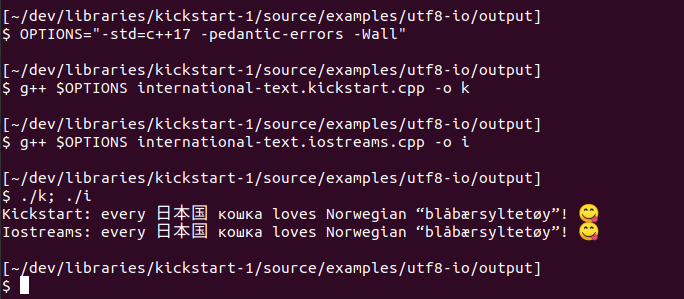
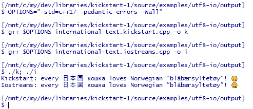
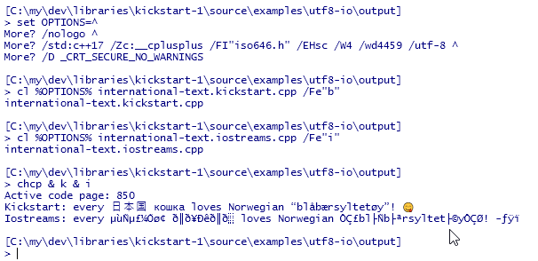
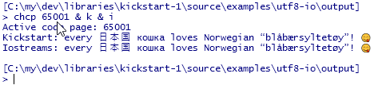
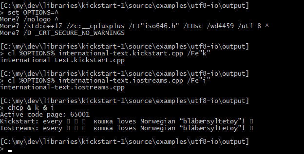
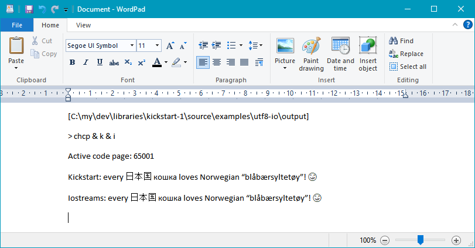

# Display international text in a console window.

Displaying international text in a portable manner is easy with Kickstart:

File [[*examples/utf8-io/output/international-text.kickstart.cpp*](international-text.kickstart.cpp)]:
~~~cpp
// Source encoding: utf-8  --  π is (or should be) a lowercase Greek pi.
#include <kickstart/all.hpp>
using namespace kickstart::all;

auto main() -> int
{
    output( "Kickstart: every 日本国 кошка loves Norwegian “blåbærsyltetøy”! 😋\n" );
}
~~~

To the best of my knowledge “日本国 кошка” means “Japanese cat”, with “Japanese” written in Chinese and “cat” written in Russian. “Blåbærsyltetøy” is Norwegian for blueberry jam. Thus the text says in a mixture of languages, that every Japanese cat loves Norwegian blueberry jam.

## About the problem.

The above text is problematic in a Windows console because

* per 2020, in most of the world a directly standard-library based C++ Windows program will by default present UTF-8 encoded Russian “кошка” as gibberish like “ð║ð¥Ðêð║ð░”;

* Windows consoles do not choose alternate fonts for symbols not found in the single selected font (i.e. they don’t do intelligent font substitution), so while Kickstart ensures that “日本国” is correctly stored in the window’s text buffer, even with Kickstart output it’s still ***presented*** as just rectangles, “▯▯▯”; and

* by the design of the API Windows consoles are by default limited to the Basic Multilingual Plane—the BMP—of Unicode, corresponding to original 16-bit Unicode, and since that part doesn’t include modern emoticons even with Kickstart output the “😋” emoticon is displayed as something else, e.g. as a single rectangle “▯”.

## Results.

### ▷ *Ubuntu terminal result.*

All is well in an **Ubuntu terminal** in a virtual machine:

The Ubuntu defaults Just Work&trade;, because

* the default C++ encoding of literals matches the terminal’s default encoding expecation, namely UTF-8, and
* the default terminal emulation provides decent Unicode text presentation.

---
### ▷ *Windows Terminal results.*

The Ubuntu defaults also work perfectly in WSL (the *Windows Subsystem for Linux*) running in a **[Windows Terminal](https://github.com/microsoft/terminal) instance**:

However, when these examples are built as Windows console programs and are run in Cmd in Windows Terminal, then the iostreams output gets messy by default:

In passing, command `cl` invokes the Visual C++ compiler, the Windows system compiler.

Here the `chcp` command reports the terminal’s active ***codepage***, the text encoding that it assumes for the program’s output. Codepage 850 is a Scandinavian variant of the original IBM PC character set. That erroneous assumption doesn’t matter for the Kickstart output, because when the output goes to the screen Kickstart uses an UTF-16 based API to do the output, but most iostreams implementations just produce a byte stream that the terminal must interpret.

A simple fix is to use the command **`chcp 65001`**, which sets the active codepage (the terminal’s encoding assumption) to codepage 65001, which is UTF-8:

The last main section shows one way that a portable iostreams-based program can do the `chcp` `65001` itself in a Windows build. But using Kickstart is already a way to solve that problem. And worth noting: as of mid January 2021, even in Windows Terminal `chcp` `65001` does not fix UTF-8 iostreams *input*, but Kickstart `input` does.

---
### ▷ *Windows console results.*

Cmd in an ordinary Windows console window:

Here Kickstart and iostreams are equally ungood for output, producing just ▯ rectangles for the Chinese characters and for the emoji.

However, Kickstart *input* works.

And the console has retained the full text information, which can be shown by copying it from the console and pasting it into Windows WordPad (command `write`):

## Programmatic `chcp` to make iostreams output work in Terminal.

In Windows, to do codepage configuration properly from within the program, so that the user doesn’t see and doesn’t have to deal with it, one would ideally use the Windows API. Here instead I show how you *can* just automate `chcp` commands like those above, by using the C++ `system` function. The separately compiled source below that does this relies on an assumption that in Windows the `system` function executes a Cmd (Microsoft: “Command Prompt”) command.

File [[*examples/utf8-io/output/windows-utf8-console.cpp*](windows-utf8-console.cpp)]:
~~~cpp
#ifndef _WIN32
#   error "This file is for Windows systems only."
#endif

#include <stdlib.h>     // system
#include <string>       // std::(to_string, string)

namespace {
    using namespace std::string_literals;
    using   std::string, std::to_string;

    auto cmd( const string& s )
        -> int
    { return ::system( s.c_str() ); }

    void set_codepage( const int id )
    {
        cmd( ""s + "chcp " + to_string( id ) + " >nul" );
    }

    auto get_codepage()
        -> int
    { return cmd( "for /f \"tokens=4\" %t in ('chcp') do @exit %t" ); }

    struct Console_codepage_fix
    {
        int original_codepage;

        ~Console_codepage_fix() { set_codepage( original_codepage ); }
        
        Console_codepage_fix():
            original_codepage( get_codepage() )
        {
            set_codepage( 65001 );
        }
    };
    
    const Console_codepage_fix the_fix = {};
}  // namespace <anon>
~~~

To use this just add the source to the build command, and voilà! 😊

But it's simpler to just use the Kickstart library or another such library, and that also supports UTF-8 input.
